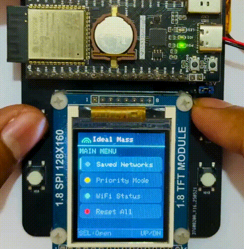

# ESP32MultiWiFiProvision

A robust, non-blocking WiFi configuration library for ESP32. Provides a beautiful captive portal, multi-network credential storage, automatic reconnection, and flexible connection priority modes - all with a simple API.

---

## ✨ Features

| Feature | Description |
|---|---|
| 📡 **Captive Portal** | Beautiful web UI served instantly; networks load in background via AJAX |
| 💾 **Multi-Network Storage** | Saves up to N credentials in NVS (Non-Volatile Storage) |
| 🔄 **Auto Reconnection** | Automatically retries saved networks if connection drops |
| 🎯 **Connection Priorities** | Last Saved (LIFO), Last Connected, or Strongest Signal |
| ⏱️ **Blocking & Non-Blocking** | Choose `connect()` (blocking) or `run()` loop (non-blocking) |
| 📢 **Event Callbacks** | `onConnected()` fires once when WiFi connects - no polling needed |
| ⚙️ **Highly Configurable** | Timeouts, retries, retry delays, auto-fallback, and more |
| 🔌 **Offline-Friendly** | Can initialize without blocking or forcing AP mode |

---

## 🎬 Demo

> Showcased on an **ESP32-S3 + ST7735 TFT (128×160)** with 4-button navigation

<table width="100%">
<tr>
<td width="50%" valign="top">

### 📡 AP Mode - Add New Network
Opens captive portal, saves credentials via phone, auto-stops AP, and returns to Saved Networks.



</td>
<td width="50%" valign="top">

### 📱 Saved Networks - Connect / Delete
Browse saved SSIDs, select one, choose Connect or Delete with instant visual feedback.


</td>
</tr>
<tr>
<td width="50%" valign="top">

### 📶 Strongest Signal - Auto Connect
Scans nearby networks, matches saved credentials, picks the strongest, and connects live.


</td>
<td width="50%" valign="top">

### 💾 Last Saved - LIFO Connect
Connects to the most recently saved network first.


</td>
</tr>
<tr>
<td colspan="2" align="center" valign="top">

### 🔄 Last Connected - Quick Reconnect
Remembers last successful connection and reconnects in one tap.

<br>


</td>
</tr>
</table>

---

## 🛠️ Hardware Used

In the demonstration videos, the system is implemented using an **ESP32-S3** with a **TFT display**. 

The hardware is built on a custom PCB that was designed and manufactured through **[JLCPCB](https://jlcpcb.com)**. The develeopment board was assembled using components from the [JLCPCB parts library](https://jlcpcb.com/parts) to simplify sourcing and assembly.

In addition, the ESP32-S3 data logger board used in the demo is also a custom design produced through [JLCPCB's PCB fabrication and PCBA services](https://jlcpcb.com/pcb-assembly). All major components used on the board are available directly from their parts library.

---

## 🆚 Why ESP32MultiWiFiProvision? (vs. WiFiManager)

The classic `WiFiManager` was originally developed for the ESP8266 and subsequently ported to the ESP32. `ESP32MultiWiFiProvision` is designed from the ground up specifically for the ESP32 architecture - focusing exclusively on multi-network environments and strictly non-blocking operation.

| Feature | Classic WiFiManager | ESP32MultiWiFiProvision |
|---|---|---|
| **Core Architecture** | Blocking by default | ✅ 100% Non-blocking (`run()` loop) |
| **Multi-Network Storage** | ⚠️ Limited / Tricky to manage | ✅ Native support (Stores N credentials) |
| **Storage Engine** | Mixed (EEPROM/FS/Core default) | ✅ Native ESP32 `Preferences` (NVS) |
| **Connection Priority** | ❌ No | ✅ Yes (Strongest, Last Connected, LIFO) |
| **Automatic Fallback** | ❌ Drops to AP immediately | ✅ Cycles through all saved networks first |
| **Event System** | ⚠️ Heavy continuous polling | ✅ Clean Callbacks (`onConnected`) |
| **Target Platform** | ESP8266 + ESP32 | ✅ 100% ESP32 Native |

---

## 📦 Installation

### PlatformIO

Add to your `platformio.ini`:

```ini
lib_deps =
    nainaiurk/ESP32MultiWiFiProvision
```

### Arduino IDE

1. Open Arduino IDE
2. Go to **Sketch → Include Library → Manage Libraries…**
3. Search for **ESP32MultiWiFiProvision**
4. Click **Install**

**Or install manually:**
1. Download this repository as a ZIP (Code → Download ZIP).
2. In Arduino IDE: **Sketch → Include Library → Add .ZIP Library…** → select the ZIP.
3. Select your ESP32 board under **Tools → Board**.

---

## 🚀 Quick Start

<div align="center" style="margin: 30px 0;">
  
  <br><br>
  <strong>📱 The Mobile Captive Portal</strong>
</div>

### Non-Blocking (Recommended)

```cpp
#include <Arduino.h>
#include <ESP32MultiWiFiProvision.h>

ESP32MultiWiFiProvision wifiConfig;
#define BUTTON_PIN 12

void setup() {
    Serial.begin(115200);
    pinMode(BUTTON_PIN, INPUT_PULLDOWN);

    wifiConfig.setAutoFallbackToAP(false);
    wifiConfig.setConnectTimeout(5000);
    wifiConfig.prioritizeStrongestSignal();

    wifiConfig.begin("Smart Device", NULL, false);
}

void loop() {
    wifiConfig.run();  // Must be called every loop

    if (digitalRead(BUTTON_PIN) == HIGH) {
        wifiConfig.startPortal();  // Opens AP at 192.168.4.1
    }

    if (wifiConfig.isConnected()) {
        // Execute connected logic here
    }
}
```

### Blocking (Simpler)

```cpp
#include <Arduino.h>
#include <ESP32MultiWiFiProvision.h>

ESP32MultiWiFiProvision wifiConfig;

void setup() {
    Serial.begin(115200);
    wifiConfig.begin("Smart Device", NULL, false);

    wifiConfig.onConnected([](String ssid) {
        Serial.println("Connected to: " + ssid);
    });

    if (!wifiConfig.connect()) {       // Blocks for up to 40s
        wifiConfig.startPortal();      // Fallback to portal
    }
}

void loop() {
    wifiConfig.run();
}
```

---

## 📖 API Reference

### Setup & Lifecycle

| Method | Description |
|---|---|
| `begin(apSSID, apPass, autoConnect)` | Initialize the library. `autoConnect=true` connects immediately; `false` waits for manual trigger. |
| `run()` | **Call every `loop()` iteration.** Handles portal, DNS, state machine, and reconnection. |
| `connect(timeout)` | Blocking connect - tries saved networks, returns `true`/`false`. Default timeout: 40s. |
| `startPortal()` | Manually opens the captive portal (AP mode at 192.168.4.1). |
| `resetSettings()` | Erases all saved credentials from NVS. |

---

### Configuration (Call Before `begin()`)

| Method | Default | Description |
|---|---|---|
| `setMaxSavedNetworks(n)` | 3 | Max credentials to store |
| `setConnectTimeout(ms)` | 10000 | Timeout per connection attempt |
| `setAutoFallbackToAP(bool)` | `true` | Start AP automatically if all connections fail |
| `setAutoReconnect(bool)` | `true` | Auto-retry if connection drops |
| `setReconnectInterval(ms)` | 10000 | Delay between reconnect attempts |
| `setMaxRetries(n)` | 3 | How many networks to try before giving up |
| `setRetryDelay(ms)` | 100 | Delay between retry attempts |
| `setPortalAutoConnect(bool)` | `true` | Auto-connect after saving via portal. Set `false` for on-demand WiFi patterns. |

---

### Connection Priority Modes

Choose how the library picks which saved network to try first:

```cpp
wifiConfig.prioritizeLastSaved();       // Default - LIFO order
wifiConfig.prioritizeLastConnected();   // Try last successful network first
wifiConfig.prioritizeStrongestSignal(); // Scan & pick best RSSI (~2-3s added)
```

**`setLastConnectedSSID(ssid)`** *(v1.3.0)* - Manually update the "Last Connected" state when connecting via `WiFi.begin()` within the application logic:

```cpp
if (WiFi.status() == WL_CONNECTED) {
    wifiConfig.setLastConnectedSSID(WiFi.SSID());
}
```

---

### Status & Callbacks

| Method | Returns | Description |
|---|---|---|
| `isConnected()` | `bool` | `true` if WiFi is connected |
| `isPortalActive()` | `bool` | `true` if AP/portal is running |
| `getConnectedSSID()` | `String` | Current SSID (empty if disconnected) |
| `getLastConnectedSSID()` | `String` | Last successfully connected SSID |
| `getStatus()` | `ConnectionStatus` | Enum: `STATUS_CONNECTED`, `STATUS_CONNECTING`, `STATUS_DISCONNECTED`, `STATUS_TIMEOUT`, `STATUS_WRONG_PASSWORD`, `STATUS_NO_SAVED_NETWORKS` |
| `getStatusMessage()` | `String` | Human-readable status (e.g., `"Connected to HomeWiFi"`) |

**`onConnected(callback)`** - Event-driven notification (fires once per connection):

```cpp
wifiConfig.onConnected([](String ssid) {
    Serial.println("Connected to: " + ssid);
});
```

---

### Credential Management

| Method | Description |
|---|---|
| `getSavedNetworkCount()` | Number of stored credentials |
| `getSavedSSID(index)` | SSID at index (0 to max-1) |
| `getSavedPassword(index)` | Password at index |
| `deleteCredential(index)` | Remove a specific credential |
| `tryConnectSaved()` | Low-level: cycle through saved networks (prefer `connect()`) |

---

## 🧠 How It Works

1. **Credentials** are stored in ESP32 NVS (persists across reboots).
2. **Portal** HTML is embedded in flash - the page loads instantly.
3. **Network scan** runs asynchronously in the background; results populate via JSON/AJAX, so the UI never blocks.
4. **State machine** in `run()` handles connection attempts, timeouts, fallbacks, and reconnection seamlessly.

---

## 📋 Changelog

### v1.3.3 (Latest)
- **Documentation:** Enhanced the README with lightweight, inline GIF animations for better cross-platform compatibility (PlatformIO Registry support).

### v1.3.2
- **Documentation:** Added a comprehensive visual demo section to showcase library capabilities.
- **Documentation:** Improved formatting and layout of the quick-start guide.

### v1.3.1
- **Examples:** Added four detailed usage sketches demonstrating basic provisioning, blocking mode routines, multi-network management, and advanced callback handling.
- **Structure:** Reorganized the repository architecture to adhere to the standard Arduino `src/` directory format.
- **Fix:** Resolved a dependency mapping issue in `library.properties` for smoother integration with ESP32 core libraries.

### v1.3.0
- **Feature:** Officially renamed library to `ESP32MultiWiFiProvision`.
- **Feature:** Added manual "Last Connected" override capability via the `setLastConnectedSSID()` method.
- **Fix:** Improved stability by resolving credential saving and preferences management issues within NVS.
- **Fix:** Corrected connection state timing logic to eliminate unintended 10-second connectivity delays.

### v1.2.8
- **Feature:** Introduced the `setPortalAutoConnect()` mechanism for strictly on-demand WiFi portal invocation.
- **Enhancement:** Enhanced captive portal user feedback loops when auto-connect behavior is disabled.

### v1.2.7
- **Feature:** Introduced the `onConnected()` event callback for streamlined, non-polling connection handling.
- **Feature:** Added flexible connection configuration options via `setMaxRetries()` and `setRetryDelay()`.
- **Enhancement:** Implemented automatic saving of the last connected SSID upon successful background connections.

### v1.2.6
- **Feature:** Introduced the synchronous `connect()` blocking method for simpler project architectures.
- **Feature:** Expanded the status API with `getLastConnectedSSID()`, `getStatus()`, and `getStatusMessage()`.
- **Feature:** Added the `ConnectionStatus` enumeration for rigid state checking and debugging.

### v1.2.5
- **Fix:** Resolved a conflict between the captive portal interactions and the backend connection state machine.
- **Fix:** Addressed an issue with `getSavedNetworkCount()` to properly iterate over contiguous network entries.

### v1.2.4
- **Fix:** Addressed an NVS storage bug (missing Preferences open/close parameters) to ensure credentials save correctly under all conditions.
- **Enhancement:** Updated the captive portal UI to feature an optional plain text password visibility toggle.
- **Enhancement:** Improved the memory replacement algorithm, guaranteeing the strict overwriting of the oldest credentials.

### v1.1.0
- **Feature:** Introduced advanced connection priority modes including Last Saved (LIFO), Last Connected, and Strongest Signal parsing.

### v1.0.0
- **Release:** Initial public release.

---

## 👤 Author

**Nainaiu Rakhaine**

[](https://www.nainaiurk.me)
[](https://www.linkedin.com/in/nainaiu-rakhaine)
[](https://github.com/nainaiurk)

---

## 📄 License

MIT - see [LICENSE](LICENSE) for details.
